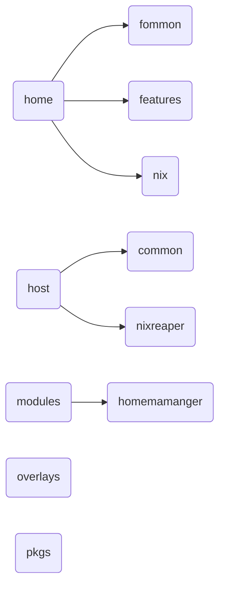

Personal Nixos Configuration

Contentes
- [Features](#features)
- [Installation](#installation)
- [Flake Structure](#flake-structure)

# Features
- Flake with integrated home-manager and modules
- ZFS file system
- Hyprland and River wayland compoistors
- Kitty terminal 
- Stylix theme (Gruvbox dark)
- Multiple host and users support
- Toggleable modules 
- Virtualisation (decleative templates)
- Containerization (declarative templates)
- Secretes integration
- NVF neovim integration
- Emacs (disabled by default)
- Flatpak support (can be used declaratively but is empty by default)
- Sops seceret management (disabled by default)
- Shell integrations (ZSH, oh-my-posh, fzf, yazi, eza, bat)

# Installation 
The official nixos images do not contain zfs kernel module, get the iso image from [here](https://github.com/nix-community/nixos-images). Follow the [official nixos install guide](https://nixos.org/manual/nixos/stable/#sec-installation-manual) upto the partition part.
## Partitioning
For partitioning we need following partitions:

- 1G for boot partition with "boot" as the partition label (also called name in some tools) and ef00 as partition code
- 4G for a swap partition with "swap" as the partition label and 8200 as partition code. We will encrypt this with a random secret on each boot.
- The rest of disk space for zfs with "root" as the partition label and 8300 as partition code (default code)

Example partitioning using nvme0n1 drive, (find the drive using `lsblk`)

```
sudo gdisk /dev/nvme0n1
GPT fdisk (gdisk) version 1.0.10
...
# boot partition
Command (? for help): n
Partition number (1-128, default 1): 
First sector (2048-1000215182, default = 2048) or {+-}size{KMGTP}: 
Last sector (2048-1000215182, default = 1000215175) or {+-}size{KMGTP}: +1G
Current type is 8300 (Linux filesystem)
Hex code or GUID (L to show codes, Enter = 8300): ef00
Changed type of partition to 'EFI system partition'

# Swap partition
Command (? for help): n
Partition number (2-128, default 2): 
First sector (2099200-1000215182, default = 2099200) or {+-}size{KMGTP}: 
Last sector (2099200-1000215182, default = 1000215175) or {+-}size{KMGTP}: +4G
Current type is 8300 (Linux filesystem)
Hex code or GUID (L to show codes, Enter = 8300): 8200
Changed type of partition to 'Linux swap'

# root partition
Command (? for help): n
Partition number (3-128, default 3): 
First sector (10487808-1000215182, default = 10487808) or {+-}size{KMGTP}: 
Last sector (10487808-1000215182, default = 1000215175) or {+-}size{KMGTP}: 
Current type is 8300 (Linux filesystem)
Hex code or GUID (L to show codes, Enter = 8300): 
Changed type of partition to 'Linux filesystem'

# write changes
Command (? for help): w

Final checks complete. About to write GPT data. THIS WILL OVERWRITE EXISTING
PARTITIONS!!

Do you want to proceed? (Y/N): y
OK; writing new GUID partition table (GPT) to /dev/nvme0n1.
The operation has completed successfully.
```
Final partition table (fdisk -l /dev/nvme0n1):
```
Number  Start (sector)    End (sector)  Size       Code  Name
   1            2048         2099199   1024.0 MiB  EF00  EFI system partition
   2         2099200        10487807   4.0 GiB     8200  Linux swap
   3        10487808      1000215175   471.9 GiB   8300  Linux filesystem
```
For the sake of simplicity drives names will be used in this guide i.e 
```
BOOT=/dev/disk/by-id/nvme-SKHynix_HFS512GDE9X081N_FNB6N634510106K5O-part1
SWAP=/dev/disk/by-id/nvme-SKHynix_HFS512GDE9X081N_FNB6N634510106K5O-part2
DISK=/dev/disk/by-id/nvme-SKHynix_HFS512GDE9X081N_FNB6N634510106K5O-part3
```

> [!NOTE]
>
> It is often recommended to specify the drive using the device ID/UUID to prevent incorrect configuration, but it is also possible to use the device name (e.g. /dev/sda). See also: [Zpool created with bus-based disk names](https://wiki.nixos.org/wiki/ZFS#Zpool_created_with_bus-based_disk_names), [Persistent block device naming - ArchWiki](https://wiki.archlinux.org/title/Persistent_block_device_naming)

## Make a ZFS pool with encryption and mount points
```
zpool create -O encryption=on -O keyformat=passphrase -O keylocation=prompt -O compression=zstd -O mountpoint=none -O xattr=sa -O acltype=posixacl -o ashift=12 zpool $DISK
# enter the password to decrypt the pool at boot
Enter new passphrase:
Re-enter new passphrase:

# Create datasets
zfs create zpool/root
zfs create zpool/nix
zfs create zpool/var
zfs create zpool/home

# Mount root
mkdir -p /mnt
mount -t zfs zpool/root /mnt -o zfsutil

# Mount nix, var, home
mkdir /mnt/nix /mnt/var /mnt/home
mount -t zfs zpool/nix /mnt/nix -o zfsutil
mount -t zfs zpool/var /mnt/var -o zfsutil
mount -t zfs zpool/home /mnt/home -o zfsutil
```

Output from `zpool status`
```
zpool status
  pool: zpool
 state: ONLINE
...
config:

	NAME                               STATE     READ WRITE CKSUM
	zpool                              ONLINE       0     0     0
	  nvme-eui.0025384b21406566-part2  ONLINE       0     0     0
```

## Format boot partition and enable swap

mkfs.fat -F 32 -n boot $BOOT (or /dev/nvme01n1)

```
mkswap -L swap $SWAP
swapon $SWAP
```

## Installation

```
# Mount boot
mkdir -p /mnt/boot
mount $BOOT /mnt/boot

# Generate the nixos config
nixos-generate-config --root /mnt
...
writing /mnt/etc/nixos/hardware-configuration.nix...
writing /mnt/etc/nixos/configuration.nix...
For more hardware-specific settings, see https://github.com/NixOS/nixos-hardware.
```

Now edit the configuration.nix that was just created in /mnt/etc/nixos/configuration.nix and make sure to have at least the following content in it. Also enable flakes.

``` /mnt/etc/nixos/configuration.nix
{
...
  # Boot loader config for configuration.nix:
  boot.loader.systemd-boot.enable = true;

  # for local disks that are not shared over the network, we don't need this to be random
  # without this, "ZFS requires networking.hostId to be set" will be raised
+  networking.hostId = "8425e349";
   nix.settings.experimental-features = [ "nix-command" "flakes" ];

...
}
```
Now check the hardware-configuration.nix in `/mnt/etc/nixos/hardware-configuration.nix` and add whats missing e.g. `options = [ "zfsutil" ]` for all filesystems except `boot` and `randomEncryption = true;` for the swap partition. Also change the generated swap device to the partition we created e.g. `/dev/disk/by-id/nvme-SKHynix_HFS512GDE9X081N_FNB6N634510106K5O-part2` in this case and `/dev/disk/by-id/nvme-SKHynix_HFS512GDE9X081N_FNB6N634510106K5O-part1` for boot.

``` /mnt/etc/nixos/hardware-configuartion.nix 
{
...
  fileSystems."/" = { 
    device = "zpool/root";
    fsType = "zfs";
    # the zfsutil option is needed when mounting zfs datasets without "legacy" mountpoints
+    options = [ "zfsutil" ];
  };

  fileSystems."/nix" = { 
    device = "zpool/nix";
    fsType = "zfs";
+    options = [ "zfsutil" ];
  };

  fileSystems."/var" = { 
    device = "zpool/var";
    fsType = "zfs";
+    options = [ "zfsutil" ];
  };

  fileSystems."/home" = {
    device = "zpool/home";
    fsType = "zfs";
+    options = [ "zfsutil" ];
  };

  fileSystems."/boot" = { 
   device = "/dev/disk/by-id/nvme-SKHynix_HFS512GDE9X081N_FNB6N634510106K5O-part1";
   fsType = "vfat";
  };

  swapDevices = [{
+    device = "/dev/disk/by-id/nvme-SKHynix_HFS512GDE9X081N_FNB6N634510106K5O-part2";
+    randomEncryption = true;
  }];
}
```

Now install nixos with `nixos-install`

## Flake installation 

>[!WARNING] 
>By default this flake creates user nix and host nixreaper. If you want to use your own names be sure to replace them in all files since i'm not using their variables

- After installing nixos boot into the new system and copy [this repo](https://github.com/naurias/nixsys) in your home directory. The folder is name `nixsys`. Copy the `hardware-configuration.nix` from `/etc/nixos/hardware-configuration.nix` to `/home/<username>/nixsys/hosts/nixreaper/hardware-configuration.nix`
- Change the username and hostname accordingly in flake.nix. For this flake the username is `nix` and hostname is `nixreaper`
- The directories hosts and home have folders respective to the username and hostname. For example `hosts/nixreaper` should be `/hosts/hostname` and `home/nix` is `home/username`
- Be sure to check all files so the user and hostnames don't get mixed up or for the sake of convinence just use the flake's own username and hostname
- After setting up usernames and hostnames install this flake using `nixos-rebuild switch --flake .#nixreaper --sudo` where `#nixreaper` is `#hostanme`

# Flake Structure
The basic flake structure is as:


The main directory contains flake and it's modules in its subdirectories 

## Hosts 
The hosts directory is to specify different hosts and what features the respective hosts wants. It contains two directories `common` and `nixreaper` which is the hostname. 
### hosname directory 
This directory contains base `configuration.nix`, `hardware-configuration.nix` and core system configurations in `sys-configs` folder. The `default.nix` file contains extra services which are toggleable and are defined within the common folder of host
### Common 
This directory contains `extraServices` folder which are services that can be toggled in main hostname folder alongside the base configuration.

The `flakedModules` folder is for services that are not in nix's official options but are added through additional flakes such as stylix and nvf. They are also enabled in `default.nix` of hostname. Do note that these changes take effect system wide. User specific configurations are in `home` folders 
## Home 
The home folder contains `common` folder which is basic home-manager options like setting unfree packages or overlays 
### username / nix 
The `nix` folder in home enables home-manager for that user. It also contains `nixreaper.nix` where specific services can be toggled on or off. These services are defined in `features` folder 
### FeaturesFolder 
This folder is used to specify services or packages to be enabled for home user (which are defined and are toggleable through home/username/hostname.nix file). Directories like cli contains setting for cli apps like zsh, apps for user apps, desktops for destop environment systems and so on.
## Modules 
This folder contains configs for modules (just like in host folder) but these modules are for home-manager. Simply import the module or nix file here from the flake. In flake they would be under home manager modules 
## Overlays 
Custom overlays and packae overrides (for specific version or patchsets)
## Pkgs 
Custom packages that are not available in official repos. 

